  
  
  
  

### About me

- Building accessible, performant UIs with React, TypeScript & modern tooling
- Pioneering AI-assisted development with Claude Code, Cursor & MCP orchestration
- Mentoring developers and shaping design systems for teams that ship
- My dog's name is Ein — like in Cowboy Bebop

> Curious about my career, talks or hire me? → [nathanredblur.dev](https://nathanredblur.dev) · [LinkedIn](https://www.linkedin.com/in/nathanredblur/)

---

### Featured Projects

<!--START_SECTION:projects-->
| Project | What it is |
|---|---|
| **[Mac Snap](https://macsnap.nathanredblur.dev/)** | A comprehensive macOS setup tool designed to streamline the process of configuring a new Mac or refreshing an existing one. Features 105+ curated applications, 42+ system tweaks, smart selection tools, and one-click Homebrew installation scripts. · [Source](https://github.com/nathanredblur/osx-setup)   `TypeScript` · `React` · `Tailwind CSS` · `Homebrew` |
| **[Brutal Print](https://print.nathanredblur.dev/)** | A modern web application for designing and printing on MXW01 thermal printers. Drag, resize, and rotate elements like Canva, then print directly via Bluetooth. Features 5 dithering algorithms, layer management, and auto-save. · [Source](https://github.com/nathanredblur/brutal-print)   `Astro` · `React` · `TypeScript` · `Fabric.js` · `Web Bluetooth` |
| **[Pension Analyzer](https://pension.nathanredblur.dev/)** | A web app that analyzes your Colpensiones contribution history and provides a complete diagnosis of your pension status, with projections and recommendations based on current Colombian regulations. 100% private — everything is processed in your browser. · [Source](https://github.com/nathanredblur/analizador-pension)   `TypeScript` · `React` · `Tailwind CSS` · `PDF.js` · `Recharts` |
<!--END_SECTION:projects-->

→ [More projects on nathanredblur.dev](https://nathanredblur.dev/projects)

---

### Latest from the Blog

<!--START_SECTION:posts-->
- **[Building a Visual Identity with Nano Banana and Gemini Gems](https://nathanredblur.dev/posts/prompt-engineering-nano-banana-frutiger-aero/)** — How I brought Frutiger Aero and Solarpunk aesthetics to my blog using AI image generation and Gemini Gems · 2026-02-01
- **[My Hybrid CSS Approach: Tailwind + Native CSS](https://nathanredblur.dev/posts/my-hybrid-css-approach-tailwind-native-css/)** — I used to hate Tailwind. Now I use it for 80% of my styling—but native CSS handles the rest. Here's why this hybrid approach works. · 2026-01-29
- **[Why I Hate Using StyleX at Work](https://nathanredblur.dev/posts/why-i-hate-using-stylex-at-work/)** — I use StyleX daily at my job. Here's why I think it's over-engineered for 99% of projects—and what I look for in CSS tools instead. · 2026-01-29
- **[Modern CSS Features You Should Be Using in 2026](https://nathanredblur.dev/posts/modern-css-features-2026/)** — Native nesting, @scope, container queries, @property—CSS has evolved dramatically. Here's what you need to know. · 2026-01-29
- **[How I Archive Videos and Images from Any Website](https://nathanredblur.dev/posts/how-i-archive-videos-and-images/)** — My personal toolkit for downloading courses, videos, and image galleries using yt-dlp and gallery-dl — including the browser cookie trick that finally made everything work. · 2026-01-07
<!--END_SECTION:posts-->

→ [Read more on nathanredblur.dev/blog](https://nathanredblur.dev/blog)

---

### Tech Stack

  

  
  
  
  
  
  
  
  
  
  
  
  
  
  
  
  
  
  

---

### GitHub Stats

  
  

---

### Recent Activity

<!--START_SECTION:activity-->
1. 🗣 Commented on [#370](https://github.com/ophub/amlogic-s9xxx-armbian/issues/370#issuecomment-1837248796) in [ophub/amlogic-s9xxx-armbian](https://github.com/ophub/amlogic-s9xxx-armbian)
2. 🗣 Commented on [#587](https://github.com/Shopify/vscode-ruby-lsp/issues/587#issuecomment-1777928495) in [Shopify/vscode-ruby-lsp](https://github.com/Shopify/vscode-ruby-lsp)
3. 🗣 Commented on [#167](https://github.com/stephencookdev/speed-measure-webpack-plugin/issues/167#issuecomment-1551988050) in [stephencookdev/speed-measure-webpack-plugin](https://github.com/stephencookdev/speed-measure-webpack-plugin)
4. 🗣 Commented on [#167](https://github.com/stephencookdev/speed-measure-webpack-plugin/issues/167#issuecomment-1551947386) in [stephencookdev/speed-measure-webpack-plugin](https://github.com/stephencookdev/speed-measure-webpack-plugin)
5. ❗ Opened issue [#87](https://github.com/victorbalssa/abacus/issues/87) in [victorbalssa/abacus](https://github.com/victorbalssa/abacus)
<!--END_SECTION:activity-->

<!--
  Sections marked START_SECTION:projects, START_SECTION:posts and START_SECTION:activity
  are automatically refreshed by .github/workflows/update-portfolio.yml
  and .github/workflows/update-readme.yml respectively.
-->
